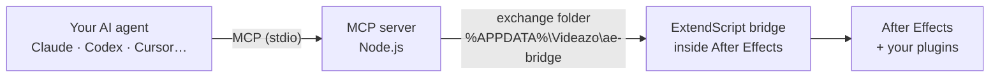

<div align="center">

# Free After Effects MCP

**Ask your AI agent for what you want in After Effects. It does it, plugins included.**

*by [Videazo Super Intelligence](https://videazo.si/intelligence)*

[](https://github.com/joshcreativos-ctrl/after-effects-mcp/actions/workflows/check.yml)
[](LICENSE)


**Claude · Codex · Cursor · Gemini CLI · Windsurf**

[Download ZIP](https://github.com/joshcreativos-ctrl/after-effects-mcp/archive/refs/heads/main.zip) · [Website and video guide](https://videazo.si/after-effects-mcp/en) · [Español](README.md)

<sub>Voiced install guide in 5 languages: [Español](https://videazo.si/after-effects-mcp) · [English](https://videazo.si/after-effects-mcp/en) · [Français](https://videazo.si/after-effects-mcp/fr) · [Português](https://videazo.si/after-effects-mcp/pt) · [中文](https://videazo.si/after-effects-mcp/zh)</sub>


<sub>Claude made this frame with this MCP: it created the comp, added the text, applied Video Copilot's Saber plugin, changed its color and position, and captured the result to check it. Without touching After Effects.</sub>

</div>

---

## What it is

An [MCP](https://modelcontextprotocol.io) server that connects your AI agent to **Adobe After Effects**. Your agent can create and edit projects, comps, layers, text, keyframes and expressions, **see the result** (it renders a frame and looks at it), render, and use **any plugin you have installed**: it reads their parameters and changes them just like native ones.

It is free and open source (MIT). It opens no network ports and sends your projects to no server of ours.

## What you can ask

```text
Tell me which version of After Effects I have and whether a project is open.
List the third-party plugins I have installed.
Create a 1920×1080, 5-second comp with a near-black background. Add the text
"Free After Effects MCP" in white, Arial Bold, and below it a yellow line of light
made with Saber. Capture the frame at second 1 and tell me what you'd improve.
Import this video, build a comp with it and render the first 5 frames.
```

## Install (Windows)

**Requirements:** After Effects (tested on **2026**; other versions may work but are untested), [Node.js 18+](https://nodejs.org) and an MCP-compatible agent.

### Option A · Paste this prompt into your agent

In Claude Code, Codex, Cursor or any agent with file and terminal access. It installs for you and asks permission first:

```text
Install Free After Effects MCP by Videazo Super Intelligence on my computer (Windows). Follow these steps and ask for my confirmation before installing:

1. Check that I'm on Windows and have After Effects and Node.js 18 or newer. If Node.js is missing, tell me how to install it (winget install OpenJS.NodeJS.LTS) and wait for my go-ahead.
2. Download only from this link: https://github.com/joshcreativos-ctrl/after-effects-mcp/archive/refs/heads/main.zip. Save it to a temporary folder and unzip it.
3. Inside the unzipped folder run `node install.mjs --dry-run` and show me what it will do.
4. With my go-ahead, run `node install.mjs`. It doesn't need administrator rights.
5. Tell me what I have to do myself, once: in After Effects, Edit > Preferences > Scripting & Expressions, and turn on "Allow Scripts to Write Files and Access Network". I turn that checkbox on, not you. Then restart After Effects and my AI agent.
6. When I'm back, test with the ae_status tool and tell me whether it works.
```

### Option B · Double-click

Download the ZIP, unzip it and open **`Instalar.cmd`**. If Node.js is missing it offers to install it.

### Option C · One line

```bash
npx github:joshcreativos-ctrl/after-effects-mcp
```

### What the installer does

No administrator rights. Everything goes to your user folders:

| Step | Where |
|---|---|
| Copies the **bridge** to After Effects' per-user startup folder (it starts with After Effects) | `%APPDATA%\Adobe\After Effects\<version>\Scripts\Startup` |
| Copies the **server** and installs its dependencies | `%LOCALAPPDATA%\Videazo\ae-mcp` |
| **Registers** the MCP as `after-effects` in the agents you have installed: Claude Code, Claude Desktop, Codex, Cursor, Gemini CLI and Windsurf | each one's config (with a `.bak-videazo` backup) |

### The one manual step

In After Effects: **Edit > Preferences > Scripting & Expressions** → turn on **"Allow Scripts to Write Files and Access Network"**.

It is an Adobe security setting; the bridge needs it to exchange files with the server. You turn it on, once, on purpose: the installer never touches it.

Then **restart After Effects and your agent**, and ask it: *"use ae_status"*.

Installer options: `--dry-run`, `--uninstall` (or `Desinstalar.cmd`), `--lang=es|en|fr|pt|zh` (defaults to your Windows language), and `--no-claude-code`, `--no-claude-desktop`, `--no-codex`, `--no-cursor`, `--no-gemini`, `--no-windsurf`.

> **Note:** automatic registration was tested in depth with Claude. For Codex, Cursor and Gemini CLI we verified the config is written correctly without touching the rest, but full use inside each one is not tested yet.

### Not on the list?

Any stdio MCP client works. Add this to its config (replace `<your-user>`):

```json
{
  "mcpServers": {
    "after-effects": {
      "command": "node",
      "args": ["C:\\Users\\<your-user>\\AppData\\Local\\Videazo\\ae-mcp\\server.mjs"]
    }
  }
}
```

## Third-party plugins

The strong point: it doesn't ship a fixed list of effects, it **discovers yours**.

1. `ae_list_effects` returns every loaded effect, native and third-party, with its `matchName` (an identifier that doesn't change with After Effects' language).
2. `ae_add_effect` adds one to a layer by `matchName`.
3. `ae_dump_properties` shows all its parameters with name, value and limits.
4. `ae_set_property` changes any of them: a fixed value, keyframes or an expression.

Real example, Video Copilot's Saber (94 parameters): `VIDEOCOPILOT LightSaber` → color `VIDEOCOPILOT LightSaber-0003`, start `…-0006`, end `…-0007`.

**Honest limits:** plugins driven only from their own window, like Element 3D's scene, can't be built with scripting alone. Your agent can combine this MCP with screen control for those.

## Tools

| Tool | What it does | Tested |
|---|---|:-:|
| `ae_status` / `ae_launch` | Opens After Effects if needed; version and project | ✔ |
| `ae_execute_script` | Runs full ExtendScript (total access) | ✔ |
| `ae_run_script_file` | Runs a `.jsx`/`.jsxbin` (e.g. a plugin's) | ✔ |
| `ae_run_command` | Runs a menu command by name, including plugin menus | — |
| `ae_list_effects` | Every effect and plugin, with its `matchName` | ✔ |
| `ae_list_plugin_files` | Plugins, scripts and extensions installed on disk | ✔ |
| `ae_project_tree` / `ae_get_comp` | Inspect the project, comps and layers | ✔ |
| `ae_create_comp` / `ae_import_files` / `ae_save_project` | Build and save the project | ✔ |
| `ae_add_layer` | Text, solid, adjustment, null, shape, camera, light or a project item | ✔ text & solid |
| `ae_dump_properties` | Property tree of a layer or effect | ✔ |
| `ae_set_property` | Value, expression and keyframes of any property | ✔ |
| `ae_add_effect` | Adds an effect or plugin and sets its parameters | ✔ |
| `ae_capture_frame` | Renders a frame and returns it as an image | ✔ |
| `ae_render` | Headless render with `aerender` (project must be saved) | ✔ |

"Tested" means we ran it against After Effects 2026 (26.2) on Windows. Those marked — exist but aren't tested in depth yet: if you hit a bug, [open an issue](https://github.com/joshcreativos-ctrl/after-effects-mcp/issues).

## How it works



The bridge (`bridge/videazo_bridge.jsx`) loads with After Effects, polls the folder every 100 ms, runs the order with the scripting engine and returns the result. **No sockets, no open ports.** Every change lands in an undo group called **"Videazo MCP"** (Ctrl+Z in After Effects).

## Troubleshooting

| Symptom | Cause and fix |
|---|---|
| *"The Videazo bridge is not installed"* | Run the installer and restart After Effects |
| *"does not allow scripts to write files"* | Turn on the Preferences setting (above) and restart After Effects |
| *"open but the bridge doesn't respond"* | After Effects won't run scripts while a dialog is open. Close it; if none, restart After Effects |
| After Effects says *"cannot run a script while a modal dialog is waiting…"* | Same thing: answer the open dialog |
| *"Crash / safe mode"* prompt on launch | Choose normal start. Don't force-quit After Effects (`taskkill`): it causes this prompt |
| Tools don't show up in my agent | Restart the agent (or open a new session). Check that `after-effects` is in its MCP list |

## FAQ

**Is it free?** Yes, and open source (MIT). Your AI agent may have its own plans and costs.

**Does it send my projects anywhere?** This MCP has no network connection: it works on your computer through a local folder. Whatever the agent reads (like your layer names) is processed by your agent, like with any other tool.

**Does it work on Mac?** Not yet: the installer and paths are Windows-only.

**Which After Effects versions?** Tested on 2026 (26.2). It needs the per-user startup scripts folder and `saveFrameToPng`; older versions may work but are unverified.

**How do I uninstall?** `Desinstalar.cmd`, or `node install.mjs --uninstall`. It removes the bridge, the server and the registration in your agents (backups are kept).

## Security

`ae_execute_script` runs code with **full access** to After Effects and the machine (ExtendScript can launch system commands). Use it only with an agent you trust and review what it asks to run. Adobe's scripting permission exists precisely for this.

## Development

```bash
git clone https://github.com/joshcreativos-ctrl/after-effects-mcp
cd after-effects-mcp
npm install
npm run check            # syntax check
npm test                 # list the tools
npm test -- ae_status    # try a tool against your After Effects
```

- The bridge is ExtendScript (ES3): no `let`/`const`/arrow functions/`JSON`, and watch out for reserved words.
- If you change `bridge/videazo_bridge.jsx`, bump `VZ_BRIDGE_VERSION` (and `BRIDGE_VERSION` in `ae-env.mjs`) and re-run the installer.

## License

[MIT](LICENSE) © 2026 Josh Creativos (Videazo). The names and logos of Adobe After Effects, Claude, Codex, Cursor, Gemini and Windsurf belong to their owners and are used only to indicate compatibility. This project is not affiliated with them.
