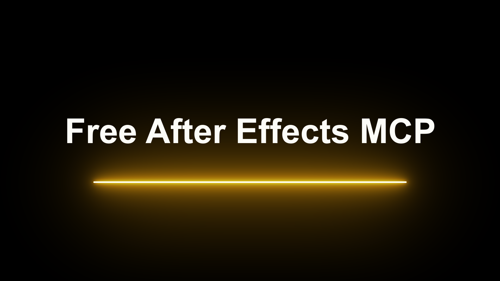
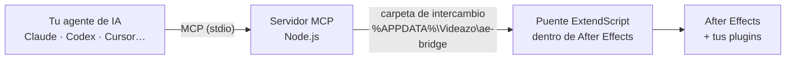

<div align="center">

# Free After Effects MCP

**Pídele a tu agente de IA lo que quieres en After Effects. Él lo hace, con tus plugins.**

*by [Videazo Super Intelligence](https://videazo.si/intelligence)*

[](https://github.com/joshcreativos-ctrl/after-effects-mcp/actions/workflows/check.yml)
[](LICENSE)


**Claude · Codex · Cursor · Gemini CLI · Windsurf**

[Descargar el ZIP](https://github.com/joshcreativos-ctrl/after-effects-mcp/archive/refs/heads/main.zip) · [Página](https://videazo.si/after-effects-mcp) · [English](README.en.md)



<sub>Este fotograma lo hizo Claude con este MCP: creó la comp, agregó el texto, puso el plugin Saber de Video Copilot, le cambió el color y la posición, y capturó el resultado para revisarlo. Sin tocar After Effects.</sub>

</div>

---

## Qué es

Un servidor [MCP](https://modelcontextprotocol.io) que conecta tu agente de IA con **Adobe After Effects**. Tu agente puede crear y editar proyectos, comps, capas, texto, keyframes y expresiones, **ver el resultado** (renderiza un fotograma y lo mira), renderizar, y usar **cualquier plugin que tengas instalado**: ve sus parámetros y los cambia igual que los nativos.

Es gratis y de código abierto (MIT). No abre puertos de red ni envía tus proyectos a ningún servidor nuestro.

## Qué puedes pedirle

```text
Dime qué versión de After Effects tengo y si hay un proyecto abierto.
Lista los plugins de terceros que tengo instalados.
Crea una comp de 1920×1080, 5 segundos, con fondo casi negro. Pon el texto
"Free After Effects MCP" en blanco, Arial Bold, y debajo una línea de luz amarilla
con Saber. Captura el fotograma en el segundo 1 y dime qué mejorarías.
Importa este video, crea una comp con él y renderiza los primeros 5 fotogramas.
```

Tu agente decide qué herramientas usar. Para ver todas las que tiene, pídele *"lista las herramientas de After Effects MCP"*.

## Instalar (Windows)

**Requisitos:** After Effects (probado en la **2026**; otras versiones pueden funcionar, pero no las hemos probado), [Node.js 18+](https://nodejs.org) y un agente compatible con MCP.

### Opción A · Pega este prompt en tu agente

En Claude Code, Codex, Cursor o cualquier agente con acceso a archivos y terminal. Él hace la instalación y te pide permiso antes:

```text
Instala Free After Effects MCP by Videazo Super Intelligence en mi computador (Windows). Sigue estos pasos y pídeme confirmación antes de instalar:

1. Comprueba que uso Windows y que tengo After Effects y Node.js 18 o más. Si falta Node.js, dime cómo instalarlo (winget install OpenJS.NodeJS.LTS) y espera mi sí.
2. Descarga solo desde este enlace: https://github.com/joshcreativos-ctrl/after-effects-mcp/archive/refs/heads/main.zip. Guárdalo en una carpeta temporal y descomprímelo.
3. Dentro de la carpeta descomprimida ejecuta `node install.mjs --dry-run` y muéstrame qué va a hacer.
4. Con mi sí, ejecuta `node install.mjs`. No necesita administrador.
5. Dime qué tengo que hacer yo, una sola vez: en After Effects, Edición > Preferencias > Scripting y expresiones, y activar "Permitir que los scripts escriban archivos y accedan a la red". Esa casilla la activo yo, no tú. Después reinicia After Effects y mi agente de IA.
6. Cuando vuelva, prueba con la herramienta ae_status y dime si funciona.
```

### Opción B · Doble clic

Descarga el ZIP, descomprímelo y abre **`Instalar.cmd`**. Si no tienes Node.js, te ofrece instalarlo.

### Opción C · Una línea

```bash
npx github:joshcreativos-ctrl/after-effects-mcp
```

### Qué hace el instalador

No pide administrador. Todo va a carpetas de tu usuario:

| Paso | Dónde |
|---|---|
| Copia el **puente** a la carpeta de inicio de After Effects (arranca solo con él) | `%APPDATA%\Adobe\After Effects\<versión>\Scripts\Startup` |
| Copia el **servidor** e instala sus dependencias | `%LOCALAPPDATA%\Videazo\ae-mcp` |
| **Registra** el MCP como `after-effects` en los agentes que tengas instalados: Claude Code, Claude Desktop, Codex, Cursor, Gemini CLI y Windsurf | la configuración de cada uno (con copia de seguridad `.bak-videazo`) |

### El único paso manual

En After Effects: **Edición > Preferencias > Scripting y expresiones** → activa **"Permitir que los scripts escriban archivos y accedan a la red"**.

Es un ajuste de seguridad de Adobe, y el puente lo necesita para intercambiar archivos con el servidor. Lo activas tú, una sola vez, a propósito: el instalador no lo toca.

Luego **reinicia After Effects y tu agente**, y pídele: *"usa ae_status"*.

Opciones del instalador: `--dry-run` (simula), `--uninstall` (o `Desinstalar.cmd`), y `--no-claude-code`, `--no-claude-desktop`, `--no-codex`, `--no-cursor`, `--no-gemini`, `--no-windsurf`.

> **Nota:** el registro automático se probó a fondo con Claude. En Codex, Cursor y Gemini CLI se comprobó que la configuración se escribe bien y sin tocar el resto, pero aún no se ha probado el uso completo dentro de cada uno.

### ¿Tu agente no está en la lista?

Cualquier cliente MCP por stdio sirve. Agrega esto en su configuración (cambia `<tu-usuario>`):

```json
{
  "mcpServers": {
    "after-effects": {
      "command": "node",
      "args": ["C:\\Users\\<tu-usuario>\\AppData\\Local\\Videazo\\ae-mcp\\server.mjs"]
    }
  }
}
```

## Plugins de terceros

El punto fuerte de este MCP: no trae una lista fija de efectos, **descubre los que tienes**.

1. `ae_list_effects` devuelve todos los efectos cargados, nativos y de terceros, con su `matchName` (un identificador que no cambia con el idioma de After Effects).
2. `ae_add_effect` agrega uno a una capa por su `matchName`.
3. `ae_dump_properties` muestra todos sus parámetros con nombre, valor y límites.
4. `ae_set_property` cambia cualquiera de ellos: valor fijo, keyframes o expresión.

Ejemplo real, con Saber de Video Copilot (94 parámetros): `VIDEOCOPILOT LightSaber` → color `VIDEOCOPILOT LightSaber-0003`, inicio `…-0006`, fin `…-0007`.

**Límites honestos:** los plugins que solo se manejan desde su propia ventana, como la escena 3D de Element 3D, no se pueden construir solo con scripting. Tu agente puede combinar este MCP con control de pantalla para esos casos.

## Herramientas

| Herramienta | Qué hace | Probada |
|---|---|:-:|
| `ae_status` / `ae_launch` | Abre After Effects si hace falta; versión y proyecto | ✔ |
| `ae_execute_script` | Ejecuta ExtendScript completo (acceso total) | ✔ |
| `ae_run_script_file` | Ejecuta un `.jsx`/`.jsxbin` (por ejemplo, el de un plugin) | ✔ |
| `ae_run_command` | Ejecuta un comando de menú por nombre, incluidos los de plugins | — |
| `ae_list_effects` | Todos los efectos y plugins, con su `matchName` | ✔ |
| `ae_list_plugin_files` | Plugins, scripts y extensiones instalados en disco | ✔ |
| `ae_project_tree` / `ae_get_comp` | Ver el proyecto, las comps y sus capas | ✔ |
| `ae_create_comp` / `ae_import_files` / `ae_save_project` | Construir y guardar el proyecto | ✔ |
| `ae_add_layer` | Texto, sólido, ajuste, nulo, forma, cámara, luz o un ítem del proyecto | ✔ texto y sólido |
| `ae_dump_properties` | Árbol de propiedades de una capa o efecto | ✔ |
| `ae_set_property` | Valor, expresión y keyframes de cualquier propiedad | ✔ |
| `ae_add_effect` | Agrega un efecto o plugin y fija sus parámetros | ✔ |
| `ae_capture_frame` | Renderiza un fotograma y te lo devuelve como imagen | ✔ |
| `ae_render` | Render sin interfaz con `aerender` (el proyecto debe estar guardado) | ✔ |

"Probada" significa que la ejecutamos contra After Effects 2026 (26.2) en Windows. Las marcadas con — existen, pero aún no las probamos a fondo: si encuentras un fallo, [abre un issue](https://github.com/joshcreativos-ctrl/after-effects-mcp/issues).

## Cómo funciona



El puente (`bridge/videazo_bridge.jsx`) se carga con After Effects, revisa la carpeta cada 100 ms, ejecuta la orden con el motor de scripting y devuelve el resultado. **No hay sockets ni puertos abiertos.** Cada cambio queda en un grupo de deshacer llamado **"Videazo MCP"** (Ctrl+Z en After Effects).

## Solución de problemas

| Síntoma | Causa y solución |
|---|---|
| *"El puente de Videazo no está instalado"* | Ejecuta el instalador y reinicia After Effects |
| *"no permite que los scripts escriban archivos"* | Activa el ajuste de Preferencias (arriba) y reinicia After Effects |
| *"abierto pero el puente no responde"* | After Effects no ejecuta scripts mientras haya un cuadro de diálogo abierto. Ciérralo; si no hay ninguno, reinicia After Effects |
| After Effects dice *"No se puede ejecutar un script mientras un diálogo modal está esperando…"* | Es lo mismo: responde el cuadro que esté abierto |
| Aviso de *"bloqueo / modo seguro"* al abrir | Elige iniciar normal. No cierres After Effects a la fuerza (`taskkill`): provoca este aviso |
| No aparecen las herramientas en mi agente | Reinicia el agente (o abre una sesión nueva). Comprueba que `after-effects` esté en su lista de MCP |

## Preguntas frecuentes

**¿Es gratis?** Sí, y de código abierto (MIT). Tu agente de IA puede tener sus propios planes y costos.

**¿Envía mis proyectos a alguna parte?** Este MCP no tiene ninguna conexión de red: trabaja en tu computador, por una carpeta local. Lo que el agente lea (por ejemplo, el nombre de tus capas) lo procesa tu agente, igual que cualquier otra herramienta.

**¿Funciona en Mac?** Todavía no: el instalador y las rutas son de Windows.

**¿Con qué versiones de After Effects?** Probado en la 2026 (26.2). Necesita la carpeta de scripts de inicio por usuario y `saveFrameToPng`; en versiones anteriores puede funcionar, pero no lo hemos verificado.

**¿Cómo lo desinstalo?** `Desinstalar.cmd`, o `node install.mjs --uninstall`. Quita el puente, el servidor y el registro en tus agentes (y deja las copias de seguridad).

## Seguridad

`ae_execute_script` ejecuta código con **acceso total** a After Effects y al equipo (ExtendScript puede lanzar comandos del sistema). Úsalo solo con un agente en el que confías y revisa lo que te pide ejecutar. El permiso de scripting de Adobe existe justo por esto.

## Desarrollo

```bash
git clone https://github.com/joshcreativos-ctrl/after-effects-mcp
cd after-effects-mcp
npm install
npm run check            # revisa la sintaxis
npm test                 # lista las herramientas
npm test -- ae_status    # prueba una herramienta contra tu After Effects
```

- El puente es ExtendScript (ES3): sin `let`/`const`/flechas/`JSON`, y cuidado con las palabras reservadas.
- Si cambias `bridge/videazo_bridge.jsx`, sube `VZ_BRIDGE_VERSION` (y `BRIDGE_VERSION` en `ae-env.mjs`) y vuelve a correr el instalador.

## Licencia

[MIT](LICENSE) © 2026 Josh Creativos (Videazo). Los nombres y logos de Adobe After Effects, Claude, Codex, Cursor, Gemini y Windsurf pertenecen a sus dueños y se usan solo para indicar compatibilidad. Este proyecto no está afiliado a ellos.
